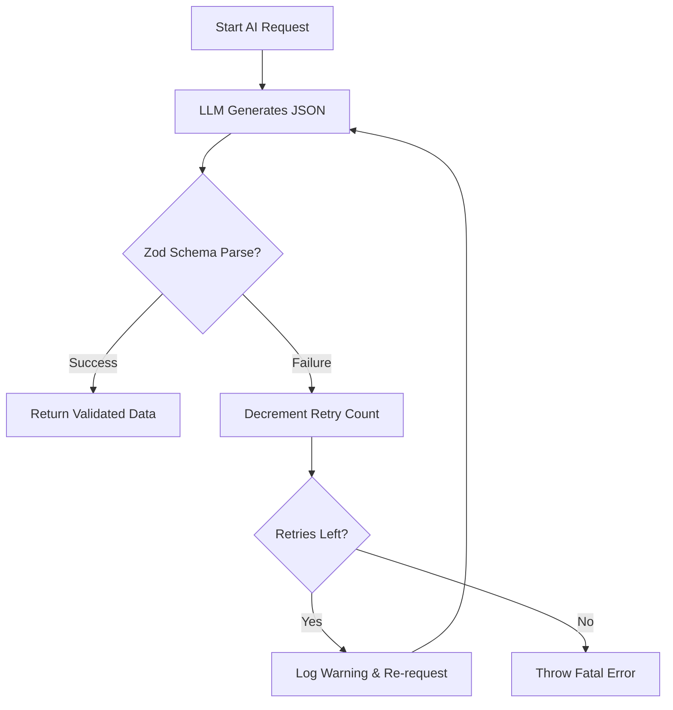

# AI Hallucination Protection Layer

This document outlines the specialized validation and safety measures implemented in the backend to ensure data integrity and protect the system from AI "hallucinations" (where the model returns incorrect formats, invalid types, or non-compliant JSON).

## 🛡️ The 3-Tier Defense Strategy

Our backend utilizes a robust defense-in-depth approach before any AI-generated data is stored in the database.

### 1. Hard JSON Mode Enforcement (Tier 1: Model Level)
Through the OpenAI API interface, specifically within `openai.chat.completions.create`, we use the `response_format: { type: 'json_object' }` configuration.
- **Goal:** This forces the model to generate a valid, parsable JSON string.
- **Protection:** It prevents the model from adding "chatty" conversational text like "Sure, here are the questions:" which would break a parser.

### 2. Strict Zod Schema Validation (Tier 2: Application Level)
All raw JSON received from the model is immediately passed through a **Zod Schema**. Zod is a TypeScript-first schema declaration and validation library.

**Example: Evaluation Schema Validation**
```typescript
const EvalSchema = z.object({
  score:     z.number().min(0).max(10), 
  reasoning: z.string(),
  followUp:  z.string().nullable().optional(),
})
```
- **Hallucination Case 1 (Wrong Type):** If the AI hallucinated a string like `"score": "High"` instead of `8`, Zod will identify it as a type mismatch.
- **Hallucination Case 2 (Out of Bounds):** If the AI hallucinated `"score": 11` (out of the 0-10 range), the `.max(10)` constraint catches it.
- **Hallucination Case 3 (Missing Field):** If the AI omitted the `reasoning` field entirely, Zod throws a validation error.

### 3. Automatic Self-Correction Workflow (Tier 3: Error Recovery)
In [ai.service.ts](file:///d:/Indium/backend/src/modules/ai/ai.service.ts), we have a recursive [chat](file:///d:/Indium/backend/src/modules/ai/ai.service.ts#21-46) function designed to handle transient hallucination failures.



- **Retry Logic:** If validation fails, we automatically retry up to **2 times**.
- **Self-Correction:** Models often fix formatting errors when re-prompted. This ensures that a single minor hallucination doesn't break the entire user experience.

## 📁 Key Files Involved

- **[ai.service.ts](file:///d:/Indium/backend/src/modules/ai/ai.service.ts):** Houses all Zod schemas and the self-correcting [chat](file:///d:/Indium/backend/src/modules/ai/ai.service.ts#21-46) loop.
- **[package.json](file:///d:/Indium/backend/package.json):** Includes `zod` and `openai` as core dependencies for this layer.

## 🚀 Benefits
- **Reliable Pipeline:** Your automated MCQ and coding rounds won't crash due to "dirty" data from the model.
- **Type Safety:** The entire backend can trust that `result.score` is a confirmed number, preventing downstream binary errors.
- **Premium UX:** Candidates see consistent, high-quality assessment feedback.
